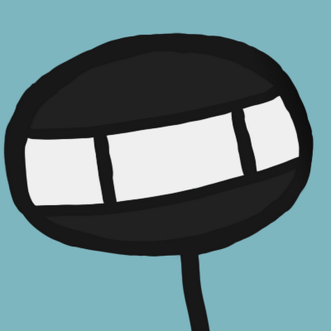

Hello, I'm Adam Kaci.
Currently a Second Year Comp Sci Student at Cal State Fullerton

Let me show you some stuff that I'm doing!

:speech_balloon: Now:
- Implementing "Bird Like Objects" (Boids) in Unity

:thought_balloon: Later:
- Explore uses of Inverse Kinematics for procedural "looking"
- Implement a recreation of Team Fortress's 2 "Rocket Jumping"
- Research implementations of Complex Gravity Simulation
- Research Modern Foliage Rendering
- Research & Implement Diegetic UI

:zzz: Previously:
- [Shipment! A game I lead the development of as a part of California State University Fullerton's Video Game Design Club](https://github.com/Adam101k/Unity-Shipment)  
- [Discord Internship bot that searches and lists job openings based on specific criteria](https://github.com/Adam101k/Internship-Discord-Bot)  
- [To The Vault! A game Developed in 15 days as a personal challenge to improve my 2D game skills](https://github.com/Adam101k/2-The-Vault)  

📝 Portfolio / 🌐 Socials:
- <a href = "https://adamkaciportfolio.myportfolio.com/work"> Adam Kaci Portfolio Website</a>  
-   
