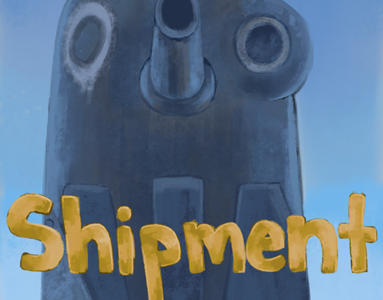

Hello, I'm Adam Kaci.
I am a second-year student at California State University Fullerton studying Computer Science.

Let me show you some stuff that I'm doing!

:speech_balloon: Now:
- Learning about Compute Shaders.
- Reading about Boids ("bird-oid object").

:thought_balloon: Later:
- Explore uses of Inverse Kinematics for procedural "looking".
- Implement a recreation of Team Fortress's 2 "Rocket Jumping"
- Research implementations of Complex Gravity Simulation
- Research Modern Foliage Rendering

:zzz: Previously:

 

   
 

