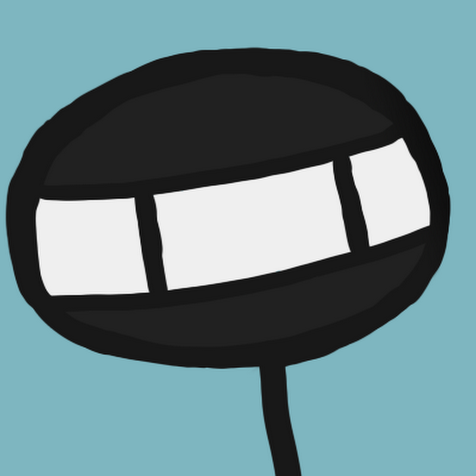
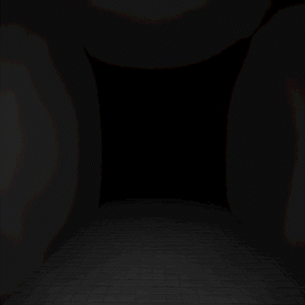
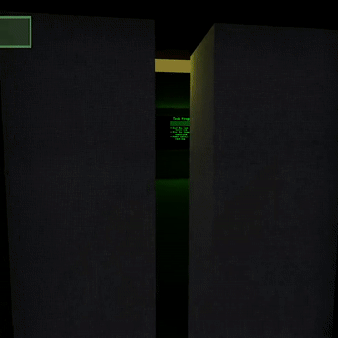
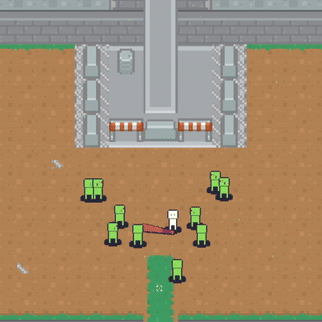
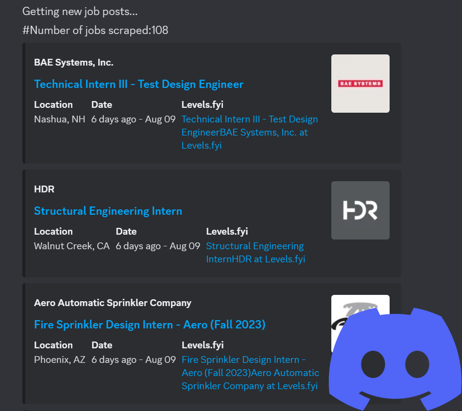
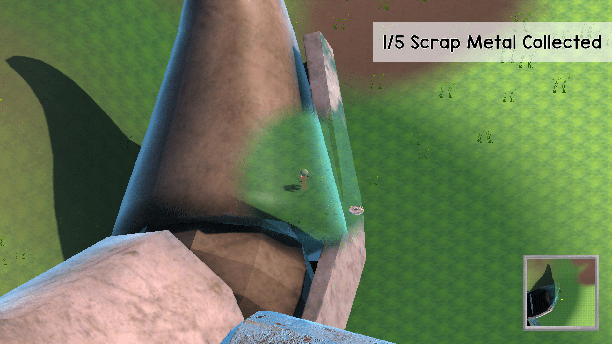

 
  

<h1 align="center">Hello! I'm Adam Kaci</h1>

I'm  Computer Science graduate from California State University, Fullerton! I love Game Development and Programming!

## 💬 Current Project
### **Benthos**
I am currently leading development on **Benthos** as the CEO / Game Director of **Doodlefish Games**, an indie game development studio. My work includes:
- Leading a team of 8+ contributors across programming, art, design, production, and outsourcing
- Developing core gameplay systems in **Unreal Engine**
- Working with **C++**, **Blueprints**, and multiplayer networking systems
- Managing weekly development workflows, task planning, code review, and team communication
- Exploring underwater rendering, stylized visuals, and immersive co-op mechanics

## 🖥️ Work Experience:
- Completed **3 software engineering internships at Google**
- Worked on **LLM and AI-powered features for Google Search**
- Built workflows converting Search and shopping data into **JSON** for machine learning systems
- Developed internal tools for **Retail Ads**, **AI**, and UX data preparation
- Built a node-based visual code authoring editor in **C++** using **ImGui** and **Protocol Buffers**
- Worked with internal 3D / XR tooling related to Google’s **Project Moohan**
- Practiced professional engineering workflows including code review, unit testing, design documents, and stakeholder collaboration

## 🛠️ Tech Stack

## 📝 Portfolio / 🌐 Socials:
 
 

# 🕹️ Featured Work

All of the GIFs below are clickable! If something interests you, click to see more!

 

  <a href="https://stickguy101.itch.io/purge-repurpose-destroy"> <a/>
    
  
    
  
    
  
    
 

