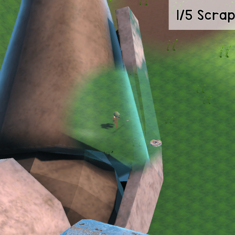

Hello, I'm Adam Kaci, a CS major at CSUF!

Let me show you some stuff that I'm doing!

:speech_balloon: Now:
- Implementing "Bird Like Objects" (Boids) in Unity

:thought_balloon: Later:
- Explore uses of Inverse Kinematics for procedural "looking"
- Implement a recreation of Team Fortress's 2 "Rocket Jumping"
- Research implementations of Complex Gravity Simulation
- Research Modern Foliage Rendering
- Research & Implement Diegetic UI

📝 Portfolio / 🌐 Socials:
- <a href = "https://adamkaciportfolio.myportfolio.com/work"> Adam Kaci Portfolio Website</a>  
-   

:zzz: Previously:

  
    
  
   
 

